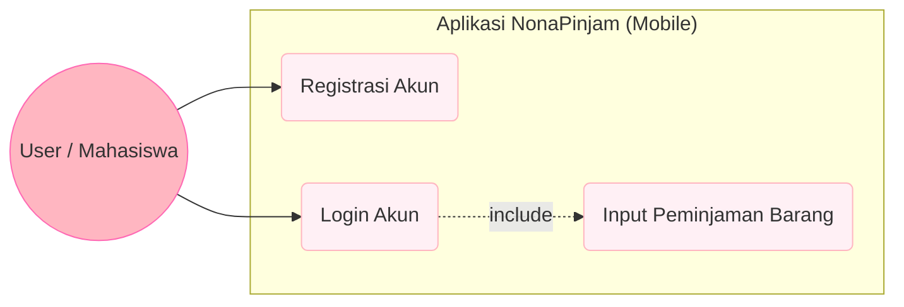
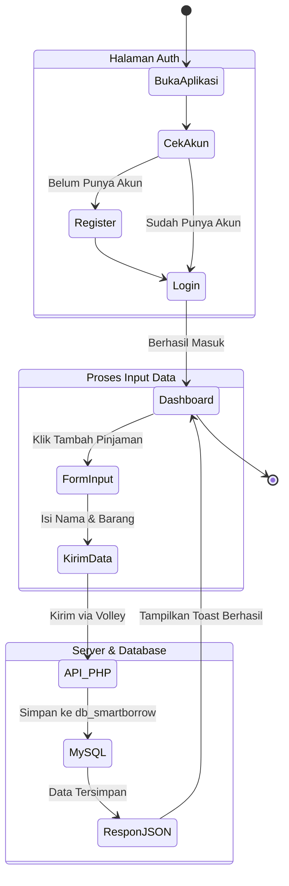
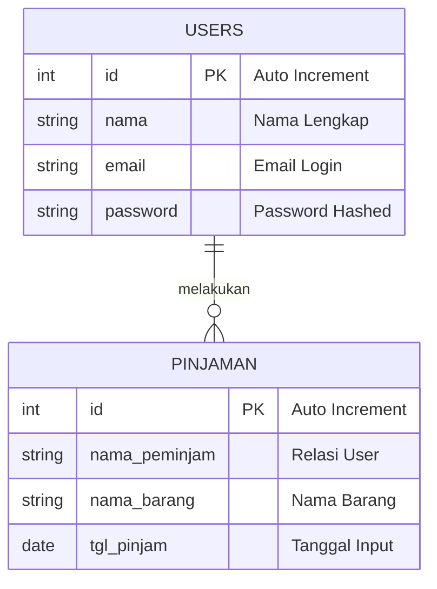

# 📦 NonaPinjam 

**Sistem Manajemen Peminjaman Barang Terintegrasi (Web & Mobile)**

 

**NonaPinjam** adalah aplikasi untuk meminjam inventaris asrama putri yang terdiri dari **Web Admin Dashboard** dan **Mobile Client App**. Sistem ini dirancang untuk memudahkan proses pencatatan dan pemantauan sirkulasi barang secara *real-time* yang tersinkronisasi di semua perangkat.

---

  

> [!NOTE]
> ### 🌸 Deskripsi Proyek
> NonaPinjam adalah aplikasi digital terintegrasi yang dirancang untuk peminjaman barang secara efisien. Proyek ini menggabungkan platform Web Admin sebagai pusat kendali data dan Aplikasi Mobile Android sebagai antarmuka utama bagi pengguna untuk melakukan transaksi peminjaman secara portabel. Dengan sinkronisasi real-time, setiap aktivitas yang dilakukan di aplikasi mobile akan langsung tercatat dalam basis data pusat.

> ### 🎯 Tujuan Utama
> Digitalisasi Inventaris: Menggantikan sistem pencatatan manual berbasis kertas dengan basis data MySQL yang terstruktur dan mudah diakses.

Efisiensi Manajemen: Mempermudah Biro Asrama Putri untuk mengoordinasi inventaris Asrama Putri 

Aksesibilitas Pengguna: Memberikan kemudahan bagi pengguna (mahasiswa/staf) untuk mendaftar akun dan menginput data peminjaman langsung dari device mereka.

Integritas Data: Menjamin keamanan akun pengguna melalui sistem autentikasi login dan registrasi yang terenkripsi.

Sinkronisasi Lintas Platform: Menghubungkan aplikasi Android dengan server lokal menggunakan REST API untuk pertukaran data yang cepat dan akurat.

## 📊 Diagram Sistem

### 1. Use Case Diagram
Diagram ini menggambarkan hak akses User di Mobile.

### 2. Activity Diagram (Alur Peminjaman Barang)
Diagram ini menjelaskan langkah-langkah yang dilakukan User di dalam aplikasi Mobile.

### 3. Entity Relationship Diagram (ERD) 🌸
Struktur tabel inti pada server MySQL

## 🛠️ Tech Stack

### 💻 Web Backend (Command Center)
* **Language**: PHP Native
* **Database**: MySQL 8.0
* **API**: RESTful JSON Endpoint

### 📱 Mobile (Digital Client)
* **Language**: Java
* **IDE**: Android Studio
* **Networking**: Volley Library
* **UI Components**: RecyclerView, CardView, TableLayout

## 📋 User Story

Bagian ini merincikan kebutuhan fungsional dari sudut pandang pengguna sistem, baik dari sisi Mobile maupun Web Dashboard.

| ID | User Story | Target | Priority |
|---|---|---|---|
| **US-01** | Sebagai **User**, saya ingin melakukan registrasi akun baru agar bisa mengakses fitur peminjaman. | Mobile | 💖 **High** |
| **US-02** | Sebagai **User**, saya ingin melakukan login dengan aman untuk melindungi data pribadi saya. | Mobile | 💖 **High** |
| **US-03** | Sebagai **User**, saya ingin menginput data barang yang akan dipinjam beserta tanggalnya melalui HP. | Mobile | 💖 **High** |
| **US-04** | Sebagai **User**, saya ingin data yang saya input di HP otomatis sinkron dengan database server pusat. | Mobile | 💖 **High** |
---

## 📝 SRS - Feature List

Berikut adalah daftar fitur utama yang diimplementasikan dalam ekosistem **NonaPinjam**:

### 🌐 Fitur Web (Admin Dashboard)
* **Pusat Monitoring**: Halaman utama untuk memantau seluruh aktivitas peminjaman barang secara real-time.
* **Management Data**: Fitur CRUD (Create, Read, Update, Delete) untuk mengelola inventaris dan data peminjam.
* **Database Integrator**: Mengelola sinkronisasi data langsung dengan MySQL database pusat.
* **API Provider**: Menyediakan endpoint RESTful JSON untuk melayani permintaan data dari aplikasi mobile.

### 📱 Fitur Mobile (Android Client)
* **Auth System**: Fitur Login dan Registrasi User untuk keamanan akses aplikasi.
* **Live Sync Dashboard**: Menarik dan menampilkan data peminjaman terbaru dari server menggunakan **Volley Library**.
* **Input Peminjaman**: Form interaktif untuk menginput nama barang dan tanggal pinjam langsung dari HP.
* **Responsive Layout**: Antarmuka yang rapi dan nyaman dipandang menggunakan **CardView** dan **TableLayout**.

---

