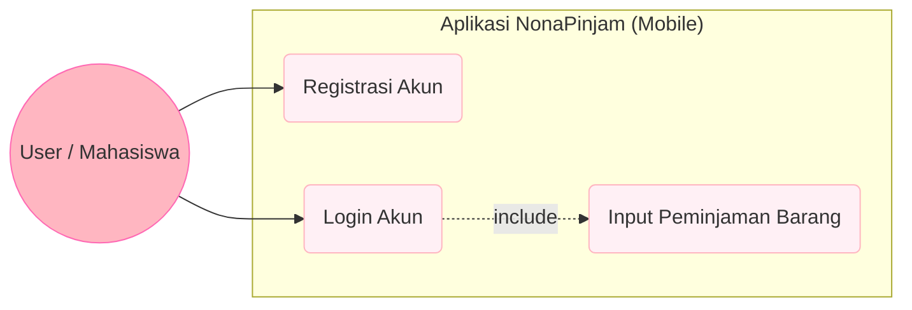

# 📦 NonaPinjam 

**Sistem Manajemen Peminjaman Barang Terintegrasi (Web & Mobile)**

 

**NonaPinjam** adalah aplikasi untuk meminjam inventaris asrama putri yang terdiri dari **Web Admin Dashboard** dan **Mobile Client App**. Sistem ini dirancang untuk memudahkan proses pencatatan dan pemantauan sirkulasi barang secara *real-time* yang tersinkronisasi di semua perangkat.

---

## 📊 Diagram Sistem

### 1. Use Case Diagram
Diagram ini menggambarkan hak akses antara Admin di Web dan User di Mobile.

sequenceDiagram
    participant App as Mobile App
    participant API as PHP API (smartborrow)
    participant DB as MySQL Database
    
    App->>API: POST Data (Nama, Barang, Tgl)
    API->>DB: INSERT INTO pinjaman
    DB-->>API: Success Response
    API-->>App: JSON {"status":"success"}
    
erDiagram
    USERS ||--o{ PINJAMAN : "melakukan"
    USERS {
        int id PK
        string name
        string email
        string password
    }
    PINJAMAN {
        int id PK
        string nama_peminjam
        string nama_barang
        date tgl_pinjam
    }
