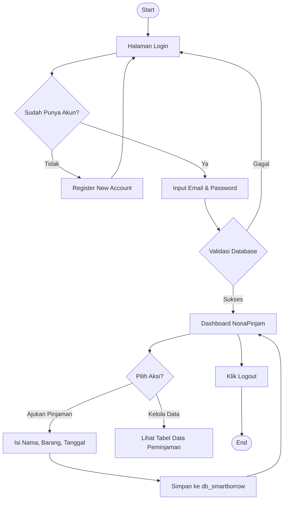
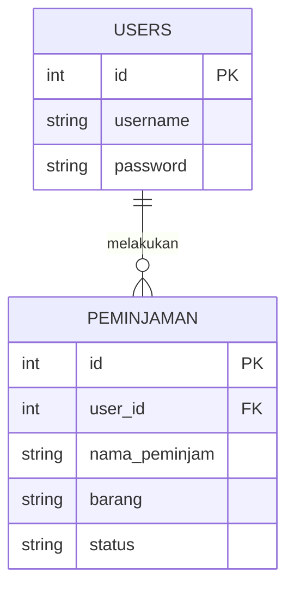

# 🎀 NonaPinjam App (SmartBorrow System)
Aplikasi manajemen peminjaman barang asrama putri berbasis web untuk pendataan yang lebih transparan dan teratur.

---

## 📑 1. Deskripsi Proyek
NonaPinjam adalah sistem informasi yang dikembangkan untuk mendigitalkan proses peminjaman barang di asrama putri. Proyek ini menggunakan **PHP Prosedural** dengan database **MySQL**.

## 🚀 2. Fitur Utama
* **Autentikasi User**: Login dan registrasi untuk keamanan akses.
* **Dashboard Dinamis**: Sapaan personal sesuai user yang login.
* **Form Peminjaman**: Penginputan Nama, NIM, Barang, dan Tanggal.
* **Monitoring Tabel**: Daftar transaksi peminjaman secara real-time.

## 📂 3. Struktur File
* `config.php`: Koneksi database.
* `login.php` & `logout.php`: Manajemen sesi user.
* `index.php`: Dashboard & Form utama.
* `peminjaman.php`: Proses CRUD data.
* `daftar_peminjaman.php`: Tabel riwayat pinjaman.

## 📊 Activity Diagram

```mermaid
flowchart TD
    Start([Start]) --> Login[Halaman Login]
    Login --> PunyaAkun{Sudah Punya Akun?}
    
    PunyaAkun -- Tidak --> Register[Register New Account]
    Register --> Login
    
    PunyaAkun -- Ya --> Auth[Input Email & Password]
    Auth --> Val{Validasi Database}
    Val -- Gagal --> Login
    
    Val -- Sukses --> Dash[Dashboard NonaPinjam]
    Dash --> Action{Pilih Aksi?}
    
    Action -- Ajukan Pinjaman --> Form[Isi Nama, Barang, Tanggal]
    Action -- Kelola Data --> Table[Lihat Tabel Data Peminjaman]
    
    Form --> Simpan[Simpan ke db_smartborrow]
    Simpan --> Dash
    
    Dash --> Logout[Klik Logout]
    Logout --> End([End])
```


```mermaid
erDiagram
    USERS ||--o{ PEMINJAMAN : "melakukan"
    USERS {
        int id PK
        string username
        string password
    }
    PEMINJAMAN {
        int id PK
        int user_id FK
        string nama_peminjam
        string barang
        string status
    }
```

## 💾 7. Skema Database (SQL)
Gunakan query berikut untuk membuat struktur tabel yang sesuai dengan sistem ini:

```sql
CREATE DATABASE db_smartborrow;

USE db_smartborrow;

CREATE TABLE users (
    id INT AUTO_INCREMENT PRIMARY KEY,
    username VARCHAR(50) NOT NULL,
    password VARCHAR(255) NOT NULL,
    role ENUM('admin', 'user') DEFAULT 'user'
);

CREATE TABLE peminjaman (
    id INT AUTO_INCREMENT PRIMARY KEY,
    user_id INT,
    nama_peminjam VARCHAR(100) NOT NULL,
    nim VARCHAR(20) NOT NULL,
    barang VARCHAR(100) NOT NULL,
    tanggal_pinjam DATE NOT NULL,
    status ENUM('Dipinjam', 'Kembali') DEFAULT 'Dipinjam',
    FOREIGN KEY (user_id) REFERENCES users(id)
);
