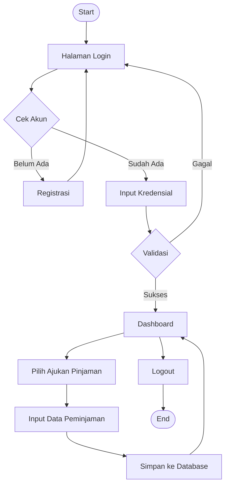

# 🎀 NonaPinjam App (SmartBorrow System)
Aplikasi manajemen peminjaman barang asrama putri berbasis web untuk pendataan yang lebih transparan dan teratur.

---

## 📑 1. Deskripsi Proyek
NonaPinjam adalah sistem informasi yang dikembangkan untuk mendigitalkan proses peminjaman barang di asrama putri. Proyek ini menggunakan **PHP Prosedural** dengan database **MySQL**.

## 🚀 2. Fitur Utama
* **Autentikasi User**: Login dan registrasi untuk keamanan akses.
* **Dashboard Dinamis**: Sapaan personal sesuai user yang login.
* **Form Peminjaman**: Penginputan Nama, NIM, Barang, dan Tanggal.
* **Monitoring Tabel**: Daftar transaksi peminjaman secara real-time.

## 📂 3. Struktur File
* `config.php`: Koneksi database.
* `login.php` & `logout.php`: Manajemen sesi user.
* `index.php`: Dashboard & Form utama.
* `peminjaman.php`: Proses CRUD data.
* `daftar_peminjaman.php`: Tabel riwayat pinjaman.

## 📊 Activity Diagram

```mermaid
flowchart TD
    A([Start]) --> B[Halaman Login]
    B --> C{Cek Akun}
    C -- Belum Ada --> D[Registrasi]
    D --> B
    C -- Sudah Ada --> E[Input Kredensial]
    E --> F{Validasi}
    F -- Gagal --> B
    F -- Sukses --> G[Dashboard]
    G --> H[Pilih Ajukan Pinjaman]
    H --> I[Input Data Peminjaman]
    I --> J[Simpan ke Database]
    J --> G
    G --> K[Logout]
    K --> L([End])
```

erDiagram
    USERS ||--o{ PEMINJAMAN : "melakukan"
    USERS {
        int id PK
        string username
        string password
    }
    PEMINJAMAN {
        int id PK
        int user_id FK
        string nama_peminjam
        string barang
        string status
    }
